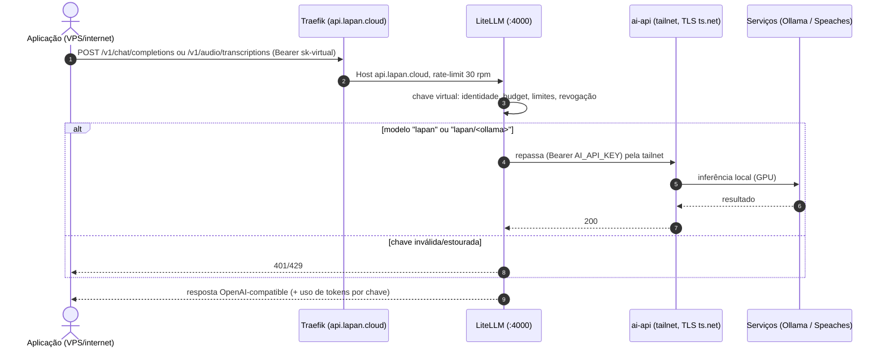
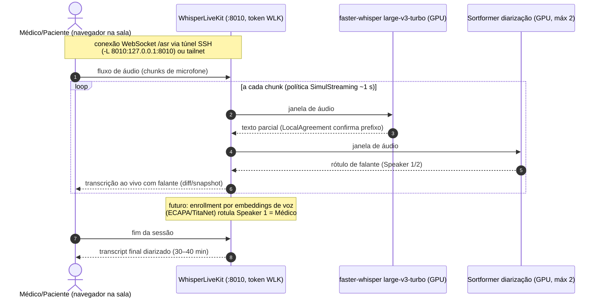

# External API Architecture — 2026-09-03

How the hospital's local AI is consumed from outside (VPS apps, chat tools,
n8n automation) without exposing the hospital network. Everything here is
deployed and validated unless noted.

```text
apps / internet
   │
   ▼
Traefik (VPS, 72.61.60.27, TLS Let's Encrypt)
   ├─ https://api.lapan.cloud  ─► LiteLLM :4000
   └─ https://n8n.lapan.cloud  ─► n8n :5678
                                    │  sandbox (Docker-in-Docker, internal)
                                    │  SearXNG (internal, JSON)
                                    ▼
                       LiteLLM Proxy (virtual keys, budgets,
                       rate limits, no message logging)
                                    │
                                    │ tailnet-only, TLS automático
                                    ▼
                https://lapan-ai.tailf9eac9.ts.net (tailscale serve)
                                    │
                                    ▼
              ai-api :8088 (FastAPI, Bearer, RAG citations)
                                    │
              ┌─────────────────────┼─────────────────────┐
              ▼                     ▼                     ▼
        Ollama :11434        Speaches :8000        WhisperLiveKit :8010
        gpt-oss:20b (titular) faster-whisper       large-v3-turbo +
        gemma4:26b / qwen3.8:27b  large-v3-turbo   Sortformer diarization
        (ver benchmark 06)                        (2 falantes, realtime)
```

## Message exchange (sequence diagrams)

### 1. Workflow "Consulta Drive → IA LAPAN" (validado 2026-09-03)

Cada salto tem sua própria autenticação: OAuth2 do Google no Drive, chave
virtual do LiteLLM na rota pública, `AI_API_KEY` do ai-api na tailnet.

```mermaid
sequenceDiagram
    autonumber
    actor U as Usuário (chat n8n)
    participant N as n8n (VPS)
    participant G as Google Drive API
    participant T as Traefik (api.lapan.cloud)
    participant L as LiteLLM (VPS)
    participant A as ai-api (lapan-ai :8088)
    participant O as Ollama (gpt-oss:20b)

    U->>N: mensagem (link Drive ou nome do arquivo + instrução)
    N->>N: Preparar busca (extrai file-id ou termo; filtra stopwords)
    N->>G: GET /drive/v3/files?q=name contains 'X' (OAuth2 Google)
    G-->>N: lista [id, name, mimeType]
    N->>N: Selecionar arquivo (prefere .md/.txt/.json/Docs)
    N->>G: GET /files/{id}?alt=media (ou /export?mimeType=text/plain)
    G-->>N: conteúdo textual do documento
    N->>T: POST /v1/chat/completions (Bearer sk-virtual-n8n)
    T->>T: TLS Let's Encrypt + rate-limit
    T->>L: roteia para LiteLLM :4000
    L->>L: valida chave virtual (rpm/budget); payload NÃO é logado
    L->>A: POST https://lapan-ai...ts.net/v1/chat/completions (Bearer AI_API_KEY, TLS tailnet)
    A->>A: RAG opcional (Qdrant/BM25 + reranker)
    A->>O: /api/chat (modelo + mensagens + contexto)
    O-->>A: geração (GPU)
    A-->>L: 200 completions (+ citations)
    L-->>T: 200 (grava só metadados no Postgres)
    T-->>N: 200 completions
    N->>N: Resposta: {output: conteúdo}
    N-->>U: resposta citada no chat
```

### 2. API pública — qualquer aplicação



### 3. Transcrição de consulta em tempo real (WhisperLiveKit)



## Components

### Hospital side (lapan-ai) — nothing public, no inbound ports

- **tailscale serve** maps `https://lapan-ai.tailf9eac9.ts.net` →
  `127.0.0.1:8088` (ai-api). Tailnet-only; the hospital is behind CGNAT with
  no fixed IP — irrelevant, Tailscale is outbound-only.
- **ai-api** (versioned at `services/ai-api/`): OpenAI-compatible
  `/v1/chat/completions`, `/v1/models`, `/v1/embeddings`, RAG citations.
- **Ollama**: titular `gpt-oss:20b` (~13.8 GB, fits the 16 GB card fully),
  alternatives `gemma4:26b` / `qwen3.8:27b` (batch), tools `qwen3:8b` /
  `qwen2.5-coder:7b`. Runtime tuned: `OLLAMA_KEEP_ALIVE=30m`,
  `OLLAMA_FLASH_ATTENTION=1`, `OLLAMA_KV_CACHE_TYPE=q8_0`.
  See the benchmark decision in
  [LLM Benchmark 2026-09-02](../04-docker-and-services/06-llm-benchmark-2026-09-02.md).
- **Speaches**: `faster-whisper-large-v3-turbo` (multilingual pt-BR — the
  previous `faster-distil-whisper-large-v3` is ENGLISH-ONLY, fixed 2026-09-02).
- **WhisperLiveKit** (`127.0.0.1:8010`): realtime consultation transcription,
  SimulStreaming (~1 s), Sortformer online diarization limited to 2 speakers,
  pt-BR. Web UI at `/`, WebSocket `/asr`, OpenAI-compatible REST
  `/v1/audio/transcriptions`, token auth (`WLK_API_TOKEN`). Built from the
  pinned clone at `/srv/ai/src/whisper-livekit` (see
  `scripts/install_whisper_livekit.sh`).
- **GPU regression note**: the ollama container was found running silently on
  CPU (`size_vram: 0`, ~6.7 tok/s on an 8B). `docker compose up -d
  --force-recreate ollama` restored GPU (72–89 tok/s). Watch `/api/ps` if
  inference feels slow.

### VPS side (lapan-vps) — the only public hop

All under `configs/vps/` (compose + runbook):

- **LiteLLM Proxy** + Postgres: single OpenAI-compatible endpoint
  `https://api.lapan.cloud/v1`. Virtual keys per consumer (`n8n-workflow`,
  `n8n-assistant`, `app-smoke`, …) with rpm/budget limits. Model routing:
  `lapan` → `gpt-oss:20b`; `lapan/<ollama-model>` passthrough.
  **LGPD: `turn_off_message_logging: true`** — clinical payloads never touch
  the VPS database; only metadata (model, tokens, key, latency).
- **Traefik** (pre-existing): routers `api.lapan.cloud` and `n8n.lapan.cloud`
  on the `traefik_proxy` network, certresolver `le`, rate-limit middleware on
  the API. Known pre-existing issue: `builder.lapan.cloud` router has no DNS
  record (NXDOMAIN).
- **n8n** + Postgres db `n8n`: automation platform.
  - **Assistant**: model via LiteLLM (`n8n-assistant` key), self-hosted
    **sandbox** (`sandbox-certs`/`sandbox-api`/`sandbox-runner-1`, internal
    only, mTLS) and **SearXNG** web search (internal, JSON format).
    Setup gotchas solved: chatTrigger now lives in
    `@n8n/n8n-nodes-langchain`; sandbox bootstrap needs `--control-sans
    sandbox-runner-1` (default SANs are n8n's local compose hostnames) and
    chown 100:101; SearXNG needs `json` format enabled and limiter off.
  - **Workflow "Consulta Drive → IA LAPAN"**
    (`n8n-workflow-drive.json`, import with a LiteLLM virtual key in place of
    `__N8N_KEY__`): chat → parse message (Drive link id or filename,
    stopword-filtered) → search Drive → pick text-preferred file → download
    (Google Docs export / alt=media) → `lapan` model → cited answer.
    Validated end-to-end 2026-09-03. v1 limitation: no PDF/Office extraction
    yet (prefer .md/.txt/.json/.csv/Google Docs).

### Tailscale ACL (grants model)

- `tag:vps-client → tag:api-server :443` (LiteLLM → hospital)
- `autogroup:member → tag:api-server :443` (member testing)
- `autogroup:member → tag:vps-client` ssh + `:443,:22` (admin; Tailscale SSH
  enabled on both nodes)

## Secrets inventory (never in the repo)

| Secret | Where |
|---|---|
| `AI_API_KEY` | hospital `/srv/ai/compose/core/.env` (ai-api bearer) |
| `LITELLM_MASTER_KEY` / `SALT_KEY` | VPS `/srv/vps/.env` |
| LiteLLM virtual keys (`sk-...`) | VPS LiteLLM DB; `n8n-*` also inside the live workflow file on the VPS |
| `WLK_API_TOKEN` | hospital `.env` |
| Google OAuth client id/secret | n8n credential `Google Drive (LAPAN)` (encrypted) |
| `SANDBOX_*`, `SEARXNG_SECRET`, `N8N_ENCRYPTION_KEY`, `POSTGRES_PASSWORD` | VPS `/srv/vps/.env` |

## Rollback

- Public path: `docker compose down` on the VPS (hospital keeps working via
  SSH tunnel as before); or revoke per-app virtual keys in LiteLLM.
- Tailnet path: remove the `tag:vps-client → tag:api-server:443` grant.
- Hospital: `tailscale serve off`; models are additive; `.env`/compose
  changes revert with `git checkout` + `docker compose up -d`.

## Next steps (open)

1. Speaker enrollment (doctor × patient) via voice embeddings on the
   diarized transcript (ECAPA/TitaNet reference embedding + cosine match).
2. Real two-voice consultation recording test through the WLK web UI
   (tunnel `-L 8010:127.0.0.1:8010`).
3. PDF/Office extraction for the Drive workflow.
4. Clinical blind review of the benchmark outputs to confirm `gpt-oss:20b`
   as the production laudo model.
5. Wire the two VPS apps (neurovisao, survey/clinical-writer) to
   `https://api.lapan.cloud/v1` with their own virtual keys.
