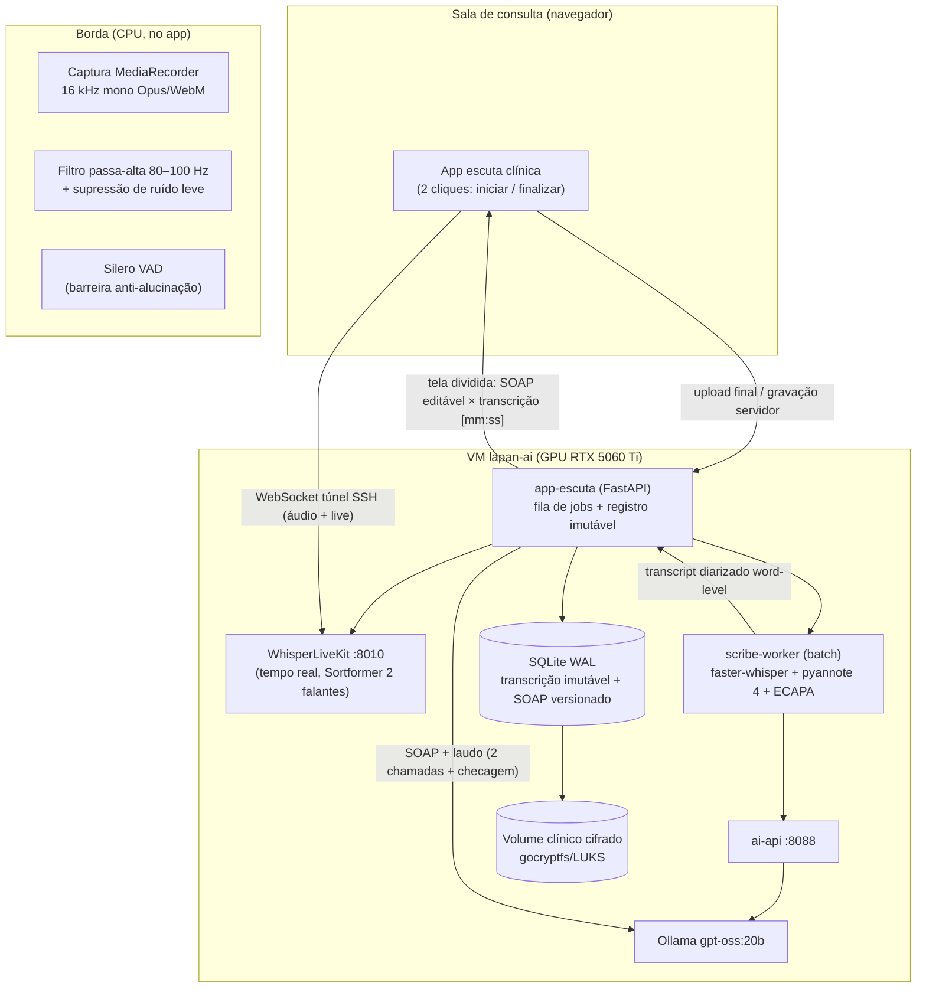

# Plano da Solução Local de Escuta Clínica — 2026-09-24

Especificação arquitetural, operacional e de engenharia para a escuta clínica
ambiente 100% local: captação de consultas de até 60 min, transcrição literal
sem colapsos autorregressivos, diarização Médico × Paciente e geração
desacoplada de prontuário SOAP, em conformidade com LGPD/CFM.

Este plano **parte da infraestrutura já validada** (ver
[Current Status](../../README.md), [External API Architecture](06-external-api-architecture.md)
e [LLM Benchmark 2026-09-02](../04-docker-and-services/06-llm-benchmark-2026-09-02.md))
e incorpora uma revisão de estado da arte de setembro/2026 (seção 2).

## 0. Resumo executivo

| Pilar | Decisão | Status |
| --- | --- | --- |
| Captação | Microfone de mesa podcast na sala (decisão 2026-09-24); 16 kHz/mono no processamento; Opus/WebM como encapsulamento leve; armazenamento cifrado | novo |
| VAD | Silero VAD (CPU, ONNX) na borda + `vad_filter` do faster-whisper no worker | novo |
| ASR batch | faster-whisper `large-v3-turbo` (fp16) como titular; `large-v3` para passada de máxima fidelidade | Speaches já roda turbo |
| ASR tempo real | WhisperLiveKit + SimulStreaming (já validado, ~1 s de latência) | existente |
| Diarização batch | pyannote-audio 4.x + alinhamento forçado word-level (stack WhisperX) | novo |
| Diarização tempo real | Sortformer online, máx. 2 falantes (já validado no WLK) | existente |
| Identificação Médico/Paciente | enrollment por embeddings ECAPA-TDNN + heurística semântica de bootstrap + verificação barata com qwen3:8b | novo (evolução planejada) |
| LLM SOAP | `gpt-oss:20b` via ai-api (titular validado no benchmark), cadeia SOAP→laudo em 2 chamadas + verificação cruzada | existente (manual) → orquestrar |
| Orquestração GPU | Modo residente no RTX 5060 Ti 16 GB (turbo 1,2 GB + gpt-oss 13,8 GB coexistem — medido); modo sequencial documentado para placas menores; **fila clínica tem prioridade sobre pesquisa** (decisão 2026-09-24) | parcialmente existente |
| UX | App leve "dois cliques" (FastAPI + web), processamento em background, visão dividida SOAP × transcrição | novo |
| Governança | Volume clínico cifrado (gocryptfs/LUKS), trilha de auditoria, expurgo programado do áudio bruto (**retenção de 90 dias no piloto**, zero no futuro — decisão 2026-09-24) | novo |

## 1. O que já existe e o que este plano acrescenta

A máquina LAPAN AI (VM `lapan-ai`, RTX 5060 Ti 16 GB via VFIO) já entrega:

- **Speaches** (`127.0.0.1:8000`): STT OpenAI-compatible, faster-whisper
  `large-v3-turbo` multilíngue em CUDA, ~1,2 GB de VRAM com `STT_MODEL_TTL=-1`.
- **WhisperLiveKit** (`127.0.0.1:8010`): transcrição em tempo real (~1 s),
  diarização online Sortformer limitada a 2 falantes, Web UI + WebSocket + REST.
- **Ollama**: `gpt-oss:20b` titular (MXFP4, ~13,8 GB, 89,5 tok/s medidos),
  `qwen3:8b` para tarefas baratas, alternativas batch (`gemma4:26b`,
  `qwen3.8:27b`).
- **ai-api** (`127.0.0.1:8088`): gateway OpenAI-compatible com Bearer + RAG.
- **Prompts clínicos** (`configs/prompts/`): laudo oftalmológico,
  transcrição→SOAP→laudo (cadeia de 2 chamadas), extração estruturada JSON.
- **Postura de segurança**: tudo em `127.0.0.1`, acesso por túnel SSH/tailnet,
  nenhuma API de nuvem para dado clínico.

Lacunas que este plano fecha: pipeline batch de fidelidade com diarização
word-level e atribuição automática Médico/Paciente; orquestração ponta a ponta
(com fila e sem intervenção manual); interface de dois cliques; criptografia
em repouso e ciclo de vida (retenção/expurgo/assinatura) do dado clínico.

## 2. Atualizações 2026 vs. prompt original

O super prompt que originou este plano foi escrito antes de parte da evolução
do ecossistema. Revisão de setembro/2026:

| Item do prompt | Estado em 2026-09 | Recomendação |
| --- | --- | --- |
| Comparar `large-v2` vs `v3` vs `large-v3-turbo` | `large-v2` é obsoleto; turbo é o padrão de custo/benefício e **já é o modelo em produção** aqui | Manter turbo como titular; `large-v3` como passada opcional de máxima fidelidade; `large-v2` descartado |
| Novos motores ASR abertos | **Voxtral** (Mistral; Voxtral Transcribe 2 com ~5,9% WER FLEURS multilíngue vs ~7,4% do Whisper, pt incluído; Voxtral-Mini-4B-Realtime para streaming); **NVIDIA Canary-1B-v2** (25 idiomas europeus incl. português, timestamps word-level nativos, suportado no WLK via NeMo — porém orientado a pt europeu); **Canary-Qwen 2.5B** lidera o Open ASR Leaderboard, mas não cobre pt-BR | Benchmark opcional (Fase 0) com áudio clínico anonimizado; nada substitui o turbo hoje sem avaliação empírica em pt-BR clínico |
| `temperature=0` absoluto | Temperatura zero **sem fallback** pode travar o decodificador em loop; o esquema de fallback de temperatura do faster-whisper é justamente o detector/retry de loop (via `compression_ratio_threshold`) | `temperature=[0.0, 0.2, 0.4…]` (fallback como rede de segurança), + `condition_on_previous_text=False` (o principal antídoto a loops), + VAD e gating de no-speech |
| Diarização pyannote 3.x | **pyannote-audio 4.x** (4.0.0 set/2025 com melhoria de atribuição de falantes; 4.0.3 dez/2025) é o padrão de fato; streaming <300 ms existe apenas na nuvem pyannote.ai (não local) | Batch: pyannote 4.x no worker; tempo real: continuar com Sortformer do WLK |
| Alinhamento forçado | **WhisperX** (faster-whisper + wav2vec2 + pyannote) segue mantido e é a referência para timestamps word-level <100 ms | Adotar a stack WhisperX como biblioteca-base do worker batch |
| VAD | **Silero VAD** continua o padrão aberto (CPU, <1 ms/chunk, 8/16 kHz); alternativas comerciais (Picovoice Cobra) sem ganho relevante aqui | Silero na borda de captação + VAD interno do faster-whisper no worker |
| LLM local | `gpt-oss:20b` confirmado pelo benchmark interno (set/2026); **GLM-4.7-Flash** surge como candidato de qualidade (200K ctx, ~3,6B ativos, cabe quantizado em 16 GB, mas KV-cache pesado em contexto longo); benchmark médico MLCR (Wisedocs, jun/2026) para referência | Manter `gpt-oss:20b` — o mais rápido medido, e **rapidez é requisito primário** (decisão 2026-09-24); GLM-4.7-Flash entra como desafiante na próxima rodada do `scripts/benchmark_llm.py` |
| Prior art | OpenWhispr (já integrado ao STT local), `offline-medical-scribe`, guias locais Whisper+Llama; dataset sintético de 8.800 consultas médico-paciente com SOAP de referência (arXiv) para avaliação | Usar o dataset sintético como base da suíte de avaliação da Fase 0 |

## 3. Visão geral e diagrama conceitual (Entregável 1)

Dois trilhos complementares sobre o mesmo hardware; o trilho batch é o núcleo
deste plano (o tempo real já está validado).



Fluxo ponta a ponta (consulta de até 60 min):

1. **Iniciar atendimento** (clique 1): app abre WebSocket com o WLK
   (transcrição ao vivo com Speaker 1/2) e passa a gravar o fluxo no servidor.
   Se a aba cair, a gravação continua no lado do servidor.
2. **Finalizar atendimento** (clique 2): fecha a sessão, o áudio completo
   (Opus/WebM 16 kHz mono) é entregue ao `app-escuta`, que cria o job batch e
   já devolve ao médico a tela de acompanhamento (sem travar a UI).
3. **scribe-worker**: decodifica para PCM 16 kHz → VAD → transcrição
   determinística (turbo; opcionalmente large-v3) → diarização pyannote 4
   (máx. 2 clusters) → alinhamento forçado word-level → matching de embeddings
   ECAPA contra o enrollment do médico → heurística/verificação de papéis →
   transcript diarizado JSON imutável (hash SHA-256) no banco.
4. **Camada de síntese (desacoplada)**: `gpt-oss:20b` via ai-api gera a nota
   SOAP em duas chamadas (SOAP → laudo) com citação de evidências `[mm:ss]`;
   uma terceira chamada barata (`qwen3:8b`) faz a verificação cruzada
   achados × laudo (Receita 4 do tutorial 09).
5. **Revisão e assinatura**: o médico edita o SOAP na tela dividida, valida
   contra a transcrição auditável e assina; a assinatura dispara a política de
   expurgo do áudio bruto (grace period configurável).

## 4. Pilar 1 — Ingestão e pré-processamento de áudio

### Captação

- **Processamento**: 16 kHz, mono, PCM s16le — é o formato nativo do Whisper;
  tudo acima disso não melhora o WER e só custa GPU.
- **Encapsulamento leve para tráfego/armazenamento**: Opus em WebM/OGG
  (~16–24 kbps VBR, ~7–10 MB por hora). O `MediaRecorder` do navegador entrega
  isso nativamente; o worker transcodifica com `ffmpeg` para PCM 16 kHz antes
  da inferência. WAV 16 bits fica como formato de intercâmbio/debug.
- **Mic (decisão 2026-09-24)**: microfone de mesa próprio para podcast,
  posicionado entre médico e paciente — capta as duas vozes num canal
  misto único. Consequências assumidas pelo desenho: a diarização carrega
  **todo** o peso da separação de falantes (não há canal físico por pessoa),
  o enrollment ECAPA e a heurística de papéis ficam críticos, e o WER será
  medido com este microfone real na Fase 0 (fala distante degrada mais que
  headset — os gates de aceite da Fase 0 serão calibrados com essa gravação).
  Checklist de sala na Fase 1: mic equidistante (~30–50 cm de cada voz),
  longe do ar-condicionado, AGC ativo.

### Pré-filtragem acústica (leve, CPU)

1. Filtro passa-alta Butterworth 80–100 Hz (remove zumbido de
   ar-condicionado e manuseio; preserva o corpo da voz).
2. Normalização de ganho por segmento (AGC suave).
3. Opcional: supressão de ruído estacionário leve (RNNoise/speexdsp).
   **Não** aplicar supressão agressiva/espectral pesada antes do Whisper —
   degrada mais do que ajuda (o modelo é robusto a ruído estacionário).
   Teclados e ruídos impulsivos ficam para o VAD isolar.

### VAD como barreira anti-alucinação

A maior fonte de "texto fantasma" do Whisper é decodificar silêncio/ruído.
O plano usa VAD em dois pontos:

- **Na borda** (Silero VAD v5+, ONNX, <1 ms/chunk em CPU): o app só envia
  janelas com fala; economiza banda e evita que silêncio longo chegue ao
  decodificador.
- **No worker** (`vad_filter=True` do faster-whisper, segmentação pyannote
  interna): remove silêncios antes da inferência e alimenta o chunking.

Regra operacional: **nenhum segmento entra no decodificador sem voz humana
confirmada por VAD** — em conjunto com `condition_on_previous_text=False`
(seção 5), é a defesa primária contra loops e alucinações de silêncio.

## 5. Pilar 2 — Camada ASR (fidelidade literal)

### Motor e variantes

Motor: **faster-whisper sobre CTranslate2** (confirmação da escolha do
prompt — segue sendo a melhor razão latência/precisão/VRAM para pt-BR local
em 2026; Speaches e WLK já o usam).

| Modelo | VRAM (fp16) | Papel | Notas |
| --- | --- | --- | --- |
| `large-v3-turbo` | ~1,2 GB (medido no Speaches) | titular batch + realtime | 809 M parâmetros, 4 camadas do decodificador; WER pt-BR próximo do large-v3 a ~4–6× mais rápido |
| `large-v3` | ~2,5–3,5 GB | passada opcional de máxima fidelidade (auditoria/contencioso) | usar quando o turbo sinalizar baixa confiança ou por política |
| `large-v2` | — | descartado | superado pelo v3/turbo |
| Voxtral / Canary-1B-v2 | a avaliar | candidatos de benchmark (Fase 0) | Voxtral 2 com WER multilíngue melhor que Whisper no FLEURS; Canary-1B-v2 com timestamps nativos, porém viés pt-europeu |

### Parâmetros determinísticos de decodificação

Perfil recomendado (worker batch; o WLK já usa política própria de streaming):

```python
WhisperModel("large-v3-turbo", device="cuda", compute_type="float16").transcribe(
    audio,
    language="pt",                        # fixa o idioma: evita drift e prosa em inglês
    beam_size=5,
    best_of=5,
    temperature=(0.0, 0.2, 0.4, 0.6, 0.8, 1.0),  # fallback = retry ao detectar loop (compression_ratio)
    condition_on_previous_text=False,     # principal antídoto a loops autorregressivos
    vad_filter=True,                      # silêncio não chega ao decodificador
    no_speech_threshold=0.6,
    log_prob_threshold=-1.0,
    compression_ratio_threshold=2.4,      # detector de repetição
    word_timestamps=True,
    initial_prompt="Consulta médica em português do Brasil. Terminologia "
                   "clínica, sintomas, dosagens de medicamentos em mg/mL, "
                   "exames e anatomia oftalmológica.",  # condiciona o vocabulário, não o conteúdo
)
```

Notas de engenharia:

- **Temperatura**: começa em 0.0; o escalonamento de fallback é a rede de
  segurança contra loop travado (temperatura zero absoluta **sem** fallback
  pode fixar a repetição — ver seção 2). O intento do prompt (determinismo)
  é preservado: 99%+ dos segmentos decodificam já em 0.0.
- **`condition_on_previous_text=False`**: neutraliza o condicionamento
  autorregressivo no texto anterior — causa nº 1 de colapsos em consultas
  longas. O custo (menos coesão de pontuação entre segmentos) é irrelevante
  para transcrição literal.
- **`initial_prompt`** injeta semântica médica no *vocabulário* (≤224 tokens,
  reaplicado por janela); não é memória de conteúdo. Termos anatômicos raros
  podem ir num glossário por especialidade.
- **Anti-repetição adicional**: pós-filtro determinístico que marca segmento
  para revisão quando `avg_logprob < -1.0` ou `compression_ratio > 2.4`
  (o worker reprocessa o trecho com `large-v3` antes de aceitar).

### Chunking guiado por VAD

- Janelas de **5–30 s** formadas por: speech-regions do VAD, fundidas quando
  o gap < 300 ms (evita picotar o ritmo), cortadas apenas em pausas ≥ 300 ms
  com `min_silence_duration_ms=300` — nunca no meio de palavra.
- Janela máxima 30 s (limite do Whisper); cortes ocorrem sempre em não-fala.
- Para realtime, o SimulStreaming do WLK já implementa essa política com
  confirmação de prefixo (LocalAgreement).

## 6. Pilar 3 — Diarização e alinhamento temporal

### Batch (novo, stack WhisperX-like no `scribe-worker`)

1. **Segmentação neural + embeddings**: pyannote-audio 4.x
   (`pyannote/speaker-diarization-3.1` ou community-1) — detecção de mudança
   de falante + embeddings de identidade vocal + clustering.
2. **Clustering restrito**: `max_speakers=2` (consulta médico-paciente);
   aceitar 3 como modo de exceção (acompanhante) com flag explícita.
3. **Alinhamento fonético forçado**: wav2vec2 fine-tuned pt-BR
   (ex. `jonatasgrosman/wav2vec2-large-xlsr-53-portuguese`) para correlacionar
   cada **palavra** do texto transcrito à respectiva janela do locutor —
   precisão típica <100 ms, o que permite atribuir com exatidão o locutor
   mesmo em trocas rápidas.
4. **Saída**: JSON por segmento
   `{start, end, speaker, text, words: [{w, t0, t1, prob}], avg_logprob}`.

### Atribuição das identidades Médico/Paciente

Camada aplicada **depois** do clustering (não mexe no áudio):

1. **Enrollment por embeddings (primário)**: na primeira consulta (ou no
   cadastro), 30 s de fala do médico geram um embedding de referência
   (ECAPA-TDNN do SpeechBrain, 192-dim, ~200 MB, CPU ou GPU) —
   "Speaker mais próximo do embedding do médico = MÉDICO". Cosine matching
   robusto a distância de microfone. Renovação do enrollment é automática
   (média móvel) após N consultas confirmadas.
2. **Heurística de bootstrap (sem enrollment)**: analisa os primeiros ~60 s
   e o padrão global — o locutor que faz perguntas (interrogativos), conduz
   a anamnese e enuncia condutas/prescrições = MÉDICO; o que responde e
   relata sintomas na primeira pessoa = PACIENTE.
3. **Verificação semântica barata (cinto e suspensório)**: uma chamada
   `qwen3:8b` com o transcript anonimizado: "classifique SPEAKER_1/SPEAKER_2
   como MÉDICO ou PACIENTE; responda JSON". Divergência entre as três fontes
   → sinalizar para confirmação manual em vez de chutar (o custo do erro de
   papel trocado é alto — o laudo sai invertido).

### Tempo real (existente)

Sortformer online (WLK) com `WLK_MAX_SPEAKERS=2` já entrega Speaker 1/2 ao
vivo. A atribuição de papel no trilho realtime usa a mesma camada
heurística/LLM sobre o transcript parcial ao finalizar a sessão.

## 7. Pilar 4 — Gestão de GPU/VRAM (Entregável 2)

### Estratégias de ciclo de vida

**Modo Sequencial (8–12 GB)** — orquestração passo a passo no `scribe-worker`:

```python
def etapa(nome, fn):
    out = fn()
    del fn                    # liberar referências aos tensores
    gc.collect()
    torch.cuda.empty_cache()  # + torch.cuda.ipc_collect() se necessário
    return out
```

- ASR → descarrega → diarização/alinhamento → descarrega → ECAPA (CPU) →
  descarrega → só então carregar o LLM.
- No Ollama: `OLLAMA_KEEP_ALIVE=0` (ou `keep_alive: 0` por chamada / endpoint
  `/api/unload`) garante que o titular saia da VRAM antes do ASR entrar.
- É o modo para RTX 3050 8GB / 4060 12GB e afins.

**Modo Residente (16–24 GB)** — o da RTX 5060 Ti atual:

| Processo | VRAM |
| --- | --- |
| Ollama `gpt-oss:20b` (MXFP4) | ~12,4–13,8 GB (medido) |
| Speaches turbo fp16 | ~1,2 GB (medido) |
| **Total coexistente** | **~15 GB de 16,3 GB — cabe (validado em set/2026)** |

- ASR batch (turbo) + LLM residente coexistem: SOAP pode começar assim que
  o transcript fecha, sem swap de modelo.
- Sessão realtime do WLK (turbo + Sortformer, ~3–4 GB) **não** coexiste com
  o titular carregado: política operacional já documentada — durante a
  consulta o Ollama fica quente apenas se o `KEEP_ALIVE` vencer; ao iniciar
  sessão WLK longa, preferir `OLLAMA_KEEP_ALIVE=0`. Em 24 GB tudo coexiste.
- O `scribe-worker` reusa o Speaches para STT quando o modelo/parâmetros
  batem; só sobe stack própria (pyannote/wav2vec2, ~1–1,5 GB) na etapa de
  diarização, liberando-a em seguida.

### Política de prioridade — fila clínica primeiro (decisão 2026-09-24)

Haverá competição real pela GPU entre o trilho clínico e a plataforma de
pesquisa (Jupyter, benchmarks, runs batch). Regra: **consulta em andamento
tem prioridade absoluta**; pesquisa é preemptável. Mecanismos:

- **Lock de GPU com dois níveis** no `app-escuta`: `clinical-high`
  (preemptivo) e `research-low` (cooperativo — jobs longos de pesquisa
  adquirirem o lock e usarem checkpoint para retomar após preempção).
- **Ao "Iniciar atendimento"**: o orquestrador garante VRAM para a sessão
  WLK descarregando o titular do Ollama
  (`docker exec ollama ollama stop gpt-oss:20b`; alternativa por API:
  chamada com `keep_alive: 0`). Isso libera ~13,8 GB — a sessão realtime
  (3–4 GB) e o batch ficam folgados.
- **Ao "Finalizar atendimento"**: `scribe-worker` roda com prioridade; ao
  fechar o transcript, o titular é recarregado para a SOAP (load ~30 s do
  SSD local — custo aceitável e transparente para o médico, que está na
  tela de revisão).
- Jobs de pesquisa em fila esperam; interativos (chat no Open WebUI)
  continuam funcionando mas podem ser preemptados quando uma consulta
  iniciar — mensagem de "recarregando modelo" é o único sintoma.
- SLA operacional: nenhuma etapa clínica espera > 5 min por causa de
  trabalho de pesquisa; `nvidia-smi` + log do lock entram no runbook.

### Quantização

- **ASR**: fp16 no 5060 Ti (measured 1,2 GB); em placas de 8–12 GB,
  `compute_type=int8_float16` corta ~40–50% com perda de WER desprezível.
- **LLM**: `gpt-oss:20b` já é MXFP4 nativo; KV-cache `q8_0` e flash
  attention já ativos no Ollama. Alternativas densas: GGUF `q4_K_M`
  (gemma4:26b, qwen3.8:27b) apenas para batch noturno.
- **Diarização/alinhamento**: fp16; pyannote e wav2vec2 são pequenos
  (<1 GB cada) e podem rodar em CPU a custo de tempo (~3–5× mais lento).

### Matriz de dimensionamento

Estimativas para **1 h de áudio** (60 min); RTF = tempo de processamento ÷
duração do áudio. Valores do 5060 Ti são estimados a partir dos medidos
(turbo 1,2 GB; gpt-oss 89,5 tok/s); validar na Fase 0.

| GPU | ASR turbo (VRAM / tempo) | Diariz.+alinh. (VRAM / tempo) | LLM SOAP | Estratégia | Viabilidade |
| --- | --- | --- | --- | --- | --- |
| 8 GB (3050/4060/5060) | int8 ~0,7 GB / ~12–20 min | ~1 GB / ~15–25 min | qwen3:8b q4 / gpt-oss não cabe | Sequencial estrito | Viável com espera (~35–50 min/consulta) |
| 12 GB (3060/4070) | fp16 1,2 GB / ~8–12 min | ~1 GB / ~10–18 min | qwen3:8b residente; 20b sequencial | Sequencial | Boa (~25–35 min) |
| **16 GB (RTX 5060 Ti — atual)** | **1,2 GB / ~6–10 min** | **~1 GB / ~8–15 min** | **gpt-oss:20b 13,8 GB residente** | **Residente** | **Boa (~15–25 min; realtime WLK com política de swap)** |
| 24 GB (3090/4090) | 1,2 GB / ~4–7 min | ~1 GB / ~6–10 min | 20b + tudo residente, sem swap | Residente plena | Excelente (~10–18 min; realtime + LLM simultâneos) |

Notas: o trilho realtime consome ~3–4 GB durante a sessão (independente do
batch); o tempo de SOAP sobre transcript de 60 min (~9–12 k tokens) é
~1–3 min no gpt-oss:20b (cadeia de 2 chamadas + verificação).

## 8. Pilar 5 — Camada desacoplada de síntese clínica (LLM local)

### Contrato de dados imutável

- O transcript diarizado é gravado **antes** de qualquer chamada de LLM:
  SQLite (WAL) com tabela append-only `transcripts` (JSON word-level + hash
  SHA-256 do áudio original + modelo/parâmetros usados).
- O LLM **nunca** recebe poder de sobrescrever: a síntese vive em
  `soap_notes` versionadas (cada revisão do médico é uma linha nova;
  nada é truncado). Áudio original referenciado por hash.
- Truncamento de contexto no LLM é controlado por política explícita de
  janelas (map-reduce por blocos de ~15 min com consolidação final), nunca
  por corte silencioso.

### System prompt (endurecimento do `configs/prompts/transcricao-para-laudo.md`)

```text
Você documenta consultas médicas em nota SOAP, português técnico do Brasil.
REGRAS INVIOLÁVEIS:
1. Use EXCLUSIVAMENTE o conteúdo da transcrição. É vedado deduzir, inferir
   ou supor qualquer achado, dosagem, diagnóstico ou exame não dito.
2. Toda afirmação da nota deve citar a evidência na transcrição no formato
   [mm:ss] do trecho que a sustenta.
3. Informação ausente → escreva "não informado". Nunca preencha lacunas.
4. Dados numéricos (dosagens, medidas, AVC) reproduzidos exatamente como
   ditados, sem conversão ou arredondamento.
5. Interprete apenas siglas clínicas inequívocas (AV, PIO, TOM…); na dúvida,
   mantenha a sigla original.
6. Erros óbvios de transcrição podem ser corrigidos apenas quando a forma
   correta é inequívoca; registre a correção entre colchetes.
Formato: S (Subjetivo), O (Objetivo), A (Avaliação), P (Plano).
```

- Chamada 1: SOAP (acima) → Chamada 2: laudo (system do
  `configs/prompts/laudo-oftalmologia.md`) → Chamada 3 (verificação):
  `qwen3:8b` cruza achados × laudo (Receita 4 do tutorial 09).
- Parâmetros: `temperature=0.2–0.3`, `max_tokens ≥ 2048` (truncamento é a
  causa nº 1 de "laudo incompleto").
- Consultas >40 min: map-reduce — SOAP por bloco temporal + consolidação
  final que apenas funde (proibido introduzir conteúdo novo).
- A rota de chamada é o ai-api (`127.0.0.1:8088`, Bearer `AI_API_KEY`),
  modelo `lapan` (LiteLLM) — sem saída para a internet.

## 9. Pilar 6 — Ergonomia operacional (UX)

- **Dois cliques**: "Iniciar atendimento" abre WebSocket no WLK (transcrição
  ao vivo com Speaker 1/2 já na tela) e inicia gravação no servidor;
  "Finalizar atendimento" dispara o job batch e leva à tela de processo.
- **Background total**: a UI é um cliente leve (FastAPI + página web com
  SSE/WebSocket para progresso do job); nada de inferência no navegador.
  Estados: `gravando → transcrevendo (progresso %) → SOAP pronta → revisão`.
- **Tela dividida de revisão**: à esquerda o SOAP editável (campos
  S/O/A/P + laudo), à direita a transcrição literal com timestamps
  clicáveis `[mm:ss]` — clicar num item da SOAP salta ao trecho do áudio
  (evidence trail). Divergências apontadas pela verificação ficam destacadas.
- **Zero login friccional**: app servido em `127.0.0.1` da VM e acessado por
  túnel SSH (padrão atual do hospital) ou tailnet; token por médico para a
  trilha de auditoria (quem assinou o quê).
- Fallback: sem app, o caminho manual atual (WLK Web UI → colar no Open
  WebUI com o template) continua funcionando — o app é orquestrador, não
  ponto único de falha.

## 10. Pilar 7 — Segurança, governança e conformidade (LGPD/CFM)

- **Rede fechada**: todo o pipeline persiste em `127.0.0.1` na VM (Speaches,
  WLK, ai-api, Ollama). Nenhuma etapa envia pacote de áudio/texto clínico
  para a internet; o VPS/LiteLLM só roteia chat de texto já autorizado e
  com `turn_off_message_logging`. O trilho clínico do plano **não usa o VPS**.
- **Criptografia em repouso**: diretório clínico dedicado
  `/srv/ai/clinical` (áudio, banco, SOAP) em **gocryptfs** montado via
  systemd (retrofit simples) ou partição LUKS (reinstalação). Backup
  (script `backup_ai_stack.sh`) só do volume fechado, com chave guardada
  separada. Permissões `0700`/`0600` e umask restrito.
- **Registro médico-legal**: transcript imutável (append-only + hash),
  SOAP versionado, assinatura do médico registrada (quem, quando, qual
  revisão). Atende ao espírito da Resolução CFM 1.821/2007 (prontuário
  eletrônico: autenticidade, integridade, rastreabilidade).
- **Expurgo programado do áudio bruto**: após assinatura do prontuário, o
  áudio é retido por **90 dias** (decisão 2026-09-24: fase piloto — a
  retenção protege contra perda caso haja problema no sistema, com respaldo
  jurídico já obtido) e então removido com `shred`/unlink seguro, com o
  evento registrado na trilha de auditoria. Parâmetro único
  `RETENTION_DAYS` (default 90 no piloto; meta futura: 0 — expurgo
  imediato pós-assinatura). O transcript assinado permanece como registro
  (LGPD: dado sensível de saúde, art. 5º II / art. 11 — minimização e
  necessidade).
- **Minimização por padrão**: nenhum dado de identificação vai ao LLM além
  do necessário; o app pode anonimizar nomes no insumo da verificação
  semântica (chamada 3).
- **Revisão jurídica**: reter as diretrizes de retenção com o jurídico da
  clínica (LGPD/ANPD + CFM); este plano fornece os controles técnicos, a
  política final é decisão de negócio.

## 11. Plano de implementação em fases (Entregável 3)

| Fase | Escopo | Entregáveis | Critério de aceite |
| --- | --- | --- | --- |
| **0 — Avaliação** (1–2 sem) | Suíte de avaliação com áudio clínico anonimizado **gravado com o microfone de mesa da sala** + dataset sintético (8.800 consultas médico-paciente, arXiv); medir WER/DER/RTF reais do turbo e large-v3, e dos candidatos **Voxtral** e **Canary-1B-v2** no 5060 Ti; rodar **GLM-4.7-Flash** no `benchmark_llm.py`. Critério norteador (decisão 2026-09-24): **rapidez primeiro** — RTF/vazão é gate primário, qualidade em empate | `scripts/bench_asr.py` + relatório com os números reais da matriz da seção 7 | RTF pipeline turbo ≤ 0,15; DER 2-falantes < 15%; WER com o mic de mesa registrado e gate calibrado na primeira rodada |
| **1 — Ingestão** (1–2 sem) | App base: captura 16 kHz/Opus + VAD Silero na borda, gravação servidor-side, volume clínico cifrado, SQLite append-only | `services/escuta/` (app + worker skeleton) | Consulta de 60 min gravada sem perda; dado só em disco cifrado |
| **2 — ASR/Diarização batch** (2–3 sem) | `scribe-worker`: VAD-chunking, decodificação determinística, pyannote 4 com máx 2, alinhamento word-level, ECAPA enrollment + heurística + verificação de papéis | Worker container + API de jobs; transcript JSON word-level | Papel Médico/Paciente correto em ≥ 95% das consultas de teste; zero loops em 10 h de teste |
| **3 — Síntese LLM** (1–2 sem) | Orquestração das 3 chamadas (SOAP → laudo → checagem) com citação [mm:ss], map-reduce p/ >40 min, gravação versionada | Pipeline no app + prompts endurecidos em `configs/prompts/` | 100% das afirmações da SOAP com evidência citada; verificação sem falso-OK |
| **4 — Interface** (2 sem) | Dois cliques, progresso em background, tela dividida com salto para [mm:ss], assinatura | Web app na VM (127.0.0.1 + túnel) | Jornada completa inici→SOAP assinada sem comando manual |
| **5 — Governança** (1 sem) | Expurgo programado, trilha de auditoria, backup do volume cifrado, runbook operacional + docs | Cron/systemd + `docs/` de operação; tutorial novo na série | Expurgo executável e auditado end-to-end |

Ordem de dependência: 0 → 1 → 2 → 3 → 4; 5 paralelo a 4. Total estimado:
6–10 semanas de esforço parcial.

## 12. Matriz de falhas e mitigações (Entregável 4)

| # | Falha/Risco | Efeito | Mitigação |
| --- | --- | --- | --- |
| 1 | Sobreposição de vozes (médico/paciente falando juntos) | Perda de texto; atribuição errada | Sortformer (realtime) já trata overlap 2 falantes; batch: overlap detection do pyannote + alinhamento word-level decide por palavra; trecho irreversível marcado `[sobreposição]` na transcrição, nunca omitido |
| 2 | Termo anatômico/medicamento raro transcrito errado | Laudo com termo trocado | `initial_prompt` com glossário da especialidade; verificação cruzada (chamada 3) sinaliza termos sem suporte; correção entre colchetes apenas quando inequívoca |
| 3 | Colapso autorregressivo (loop de repetição) | Transcrição inútil a partir do ponto | `condition_on_previous_text=False` + VAD + fallback de temperatura + `compression_ratio_threshold`; reprocessamento automático do trecho com large-v3 |
| 4 | Alucinação em silêncio/ruído | Texto nunca dito no registro | Dupla barreira VAD (borda + worker); `no_speech_threshold=0.6`; flag de revisão em `avg_logprob` baixo |
| 5 | Papéis Médico/Paciente trocados | SOAP invertida (erro grave) | Tripla checagem (enrollment ECAPA + heurística + LLM 8B); divergência → confirmação manual obrigatória; troca de rótulos é operação de 1 clique que regenera a SOAP |
| 6 | Gargalo de VRAM (sessão WLK + LLM titular) | OOM ou swap lento | Política residente/sequencial da seção 7; `OLLAMA_KEEP_ALIVE=0` ao iniciar sessão; monitorar `nvidia-smi` no runbook (regressão GPU já ocorreu — ver nota no doc de API externa) |
| 7 | Aba do navegador fechada / queda de rede no meio da consulta | Perda da gravação | Gravação é servidor-side (WebSocket chega ao app, que persiste janelas cifradas); navegador é só display |
| 8 | Queda de energia / crash do worker | Consulta perdida | SQLite WAL + escrita incremental por janela; job retomável do último segmento confirmado |
| 9 | Contexto > janela do LLM em consulta de 60 min | SOAP truncada | Map-reduce por blocos com consolidação; `max_tokens ≥ 2048`; gpt-oss:20b tem 128K ctx — folga grande |
| 10 | Vazamento de dado clínico | Sanção LGPD + sigilo médico | Tudo em 127.0.0.1 + túnel; trilho clínico sem VPS; criptografia em repouso; sem logs de payload; revisão de portas (`ss -tlnp`) no runbook |
| 11 | Áudio ruim (fala distante do microfone de mesa, sala ruidosa) | WER alto | Checklist de posicionamento do mic (equidistante, longe do AC); AGC; qualidade por segmento (logprob) sinaliza trechos frágeis na revisão; se a Fase 0 medir WER insatisfatório com o mic atual, reavaliar captação (2 mics ou headset) antes de otimizar modelo |
| 12 | Modelo ASR/LLM degradado após update | Regressão silenciosa | Modelos pinados no compose; suíte da Fase 0 como gate de regressão antes de promover qualquer mudança |

## 13. Decisões registradas (2026-09-24) e itens remanescentes

Decisões tomadas pelo responsável:

1. **Captação**: microfone de mesa podcast na sala (canal misto único, capta
   médico e paciente). A diarização/enrollment assume todo o peso da
   separação — ver seção 4.
2. **Retenção do áudio bruto**: 90 dias no piloto (proteção contra falha do
   sistema, respaldo jurídico obtido); meta futura de zero retenção
   pós-assinatura. Parâmetro `RETENTION_DAYS` na governança (seção 10).
3. **Benchmark da Fase 0**: incluir GLM-4.7-Flash (LLM) e Voxtral +
   Canary-1B-v2 (ASR) junto ao Whisper. Critério norteador: **rapidez é
   fundamental** — RTF/vazão é gate primário.
4. **Política de GPU**: haverá competição com pesquisa; a fila clínica tem
   prioridade absoluta (lock preemptivo — seção 7).

Itens remanescentes (menores, resolvidos na Fase 0/1):

- Modelo exato do microfone e posicionamento ideal na mesa (checklist de
  sala) — registrar na primeira rodada de gravações de teste.
- Calibração dos gates de WER com o microfone real (fala distante) antes de
  congelar critérios de aceite.
- Janela preferencial para jobs de pesquisa longos (madrugada?) — definir no
  runbook junto ao lock de GPU.

## 14. Referências da revisão 2026-09

- [Speaches](https://github.com/speaches-ai/speaches) ·
  [WhisperLiveKit](https://github.com/QuentinFuxa/WhisperLiveKit) ·
  [faster-whisper](https://github.com/SYSTRAN/faster-whisper)
- [pyannote-audio 4.x (releases)](https://github.com/pyannote/pyannote-audio) ·
  [WhisperX](https://github.com/m-bain/whisperX) ·
  [Silero VAD](https://github.com/snakers4/silero-vad)
- [Canary-1B-v2 & Parakeet-TDT v3 (arXiv 2509.17474)](https://arxiv.org/abs/2509.17474) ·
  [nvidia/canary-1b-v2](https://huggingface.co/nvidia/canary-1b-v2)
- [Voxtral (Mistral AI)](https://mistral.ai/news/voxtral) ·
  [Voxtral-Mini-4B-Realtime (HF)](https://huggingface.co/mistralai)
- [Introducing gpt-oss (OpenAI)](https://openai.com/open-models) ·
  [GLM-4.7-Flash — how to run locally (Unsloth)](https://unsloth.ai)
- Open ASR Leaderboard (HF) via
  [Gladia — best open-source STT 2026](https://www.gladia.io);
  benchmark pt-BR [tech4humans](https://huggingface.co/tech4humans);
  benchmark [CAMÕES (arXiv)](https://arxiv.org)
- [Wisedocs MLCR — medical long-context benchmark](https://www.wisedocs.ai)
- Prior art local-first: [OpenWhispr](https://openwhispr.com) ·
  [offline-medical-scribe](https://github.com/harishkotra/offline-medical-scribe)
- ECAPA-TDNN:
  [speechbrain/spkrec-ecapa-voxceleb](https://huggingface.co/speechbrain/spkrec-ecapa-voxceleb)
