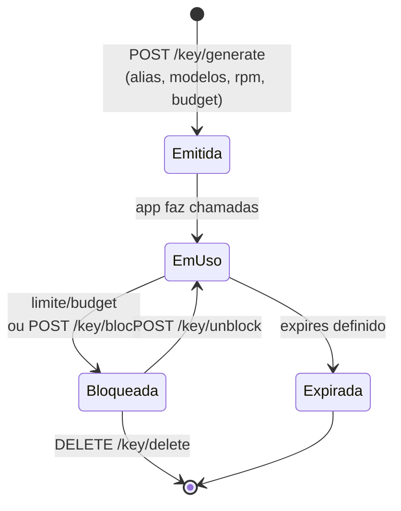

# Tutorial 02 — Chaves virtuais (LiteLLM)

Chave virtual = credencial emitida pelo nosso gateway (LiteLLM) para um
consumidor específico, com identidade, limites e revogação independentes.
**Nunca distribua a master key.**

## Ciclo de vida de uma chave



## Emitir uma chave (no VPS)

```bash
ssh root@lapan-vps
cd /srv/vps && set -a && . ./.env && set +a

curl -s http://127.0.0.1:4000/key/generate \
  -H "Authorization: Bearer $LITELLM_MASTER_KEY" \
  -H "Content-Type: application/json" \
  -d '{
        "key_alias": "meu-app",
        "models": ["lapan", "lapan/*"],
        "rpm_limit": 30,
        "max_budget": 10,
        "budget_duration": "30d"
      }'
# A resposta traz o campo "key" (sk-...) — guarde ali mesmo: ele não é
# recuperável depois, apenas bloqueável.
```

Parâmetros úteis: `rpm_limit`/`tpm_limit` (ritmo), `max_budget` +
`budget_duration` (custo, US$ nominais), `models` (allowlist), `expires`
(data), `team_id` (agrupar por equipe).

## Gerir pelo painel (UI)

`https://api.lapan.cloud/ui` → login com a **master key** → aba *Keys*:
criar, editar limites, bloquear/desbloquear, ver spend por chave. Também é
possível ver spend por equipe e por modelo.

## Inventário atual (2026-09-04)

| Alias | Situação | Uso |
|---|---|---|
| `n8n` | ativa (60 rpm) | reservada para automações gerais n8n |
| `n8n-workflow` | ativa (30 rpm) | workflow "Consulta Drive → IA LAPAN" |
| `n8n-assistant` | ativa (20 rpm, US$ 3/30d) | Assistant do n8n |
| `lapan-test`, `-2`, `-3`, `app-smoke`, `smoke-final` | **bloqueadas** | testes do deploy |

## Bloquear/revogar

```bash
# Pelo painel (UI) é um clique. Via API precisa do valor sk-...;
# sem o valor, bloqueie direto no banco (o que fizemos com as de teste):
ssh root@lapan-vps 'docker exec lapan-postgres psql -U lapan -d litellm \
  -c "UPDATE \"LiteLLM_VerificationToken\" SET blocked = true WHERE key_alias = '\''meu-app'\'';"'
```

## Política recomendada

- 1 chave por aplicação/por pessoa — nunca reutilizar entre consumidores.
- Budget pequeno para experimentos (US$ 1–5) e `expires` curto para
  ferramentas temporárias.
- Ao desligar um projeto: bloquear (não apagar) primeiro; apagar só depois
  de confirmar que nada mais usa.
- Rotacionar semestralmente: emita a nova, migre o consumidor, bloqueeie a
  antiga.
