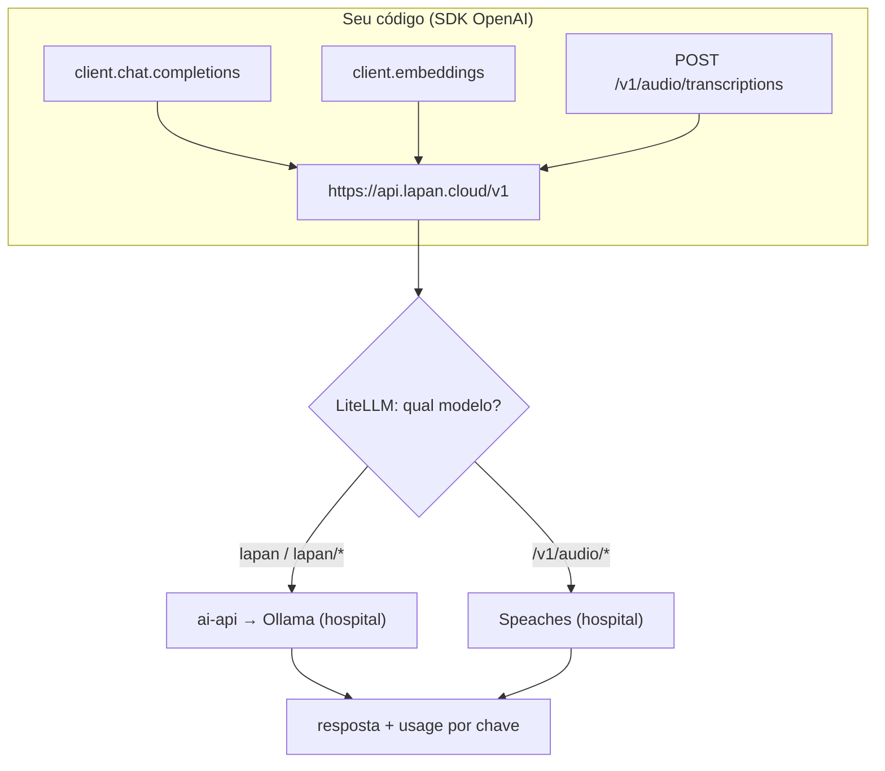

# Tutorial 03 — SDK OpenAI apontado ao modelo local

O endpoint é OpenAI-compatible: qualquer SDK/biblioteca "OpenAI" funciona
trocando `base_url` e a chave. **Nenhum dado vai para a OpenAI.**

## O que cada chamada vira no nosso stack



## Python

```bash
pip install openai
```

```python
from openai import OpenAI

client = OpenAI(
    base_url="https://api.lapan.cloud/v1",
    api_key="sk-SUA-CHAVE-VIRTUAL",
)

# Chat
resp = client.chat.completions.create(
    model="lapan",
    messages=[
        {"role": "system", "content": "Responda em português técnico."},
        {"role": "user", "content": "Explique o teste de Ishihara em 3 linhas."},
    ],
    max_tokens=300,
)
print(resp.choices[0].message.content)

# Streaming
for chunk in client.chat.completions.create(
    model="lapan",
    messages=[{"role": "user", "content": "Escreva uma introdução sobre glaucoma."}],
    stream=True,
):
    if chunk.choices[0].delta.content:
        print(chunk.choices[0].delta.content, end="", flush=True)
```

### Embeddings (RAG próprio)

```python
vec = client.embeddings.create(model="bge-m3", input=["texto do documento"])
print(vec.data[0].embedding[:5], "...", len(vec.data[0].embedding), "dimensões")
```

### Transcrição de arquivo

```python
with open("consulta.m4a", "rb") as f:
    tr = client.audio.transcriptions.create(model="whisper-1", file=f, language="pt")
print(tr.text)
```

## JavaScript/Node

```js
import OpenAI from "openai";
const client = new OpenAI({
  baseURL: "https://api.lapan.cloud/v1",
  apiKey: process.env.LAPAN_KEY,
});
const r = await client.chat.completions.create({
  model: "lapan",
  messages: [{ role: "user", content: "Resuma: póós-operatório de facectomia." }],
});
console.log(r.choices[0].message.content);
```

## Bônus: RAG com citações direto no gateway do hospital

Pela tailnet (dentro da rede Tailscale), o ai-api expõe recuperação com
citações além do chat:

```bash
curl https://lapan-ai.tailf9eac9.ts.net/v1/chat/completions \
  -H "Authorization: Bearer $AI_API_KEY" -H "Content-Type: application/json" \
  -d '{"model":"qwen3:8b","messages":[{"role":"user","content":"cite trechos sobre Farnsworth D15"}]}'
# A resposta inclui "citations" com os trechos usados da base de pesquisa.
```

## Configuração de ferramentas compatíveis

Qualquer app com "OpenAI custom base URL" aponta para
`https://api.lapan.cloud/v1` + chave virtual. Exemplos que funcionam assim:
Continue/Cline (IDE), Open WebUI, apps internos, LangChain/LlamaIndex.
