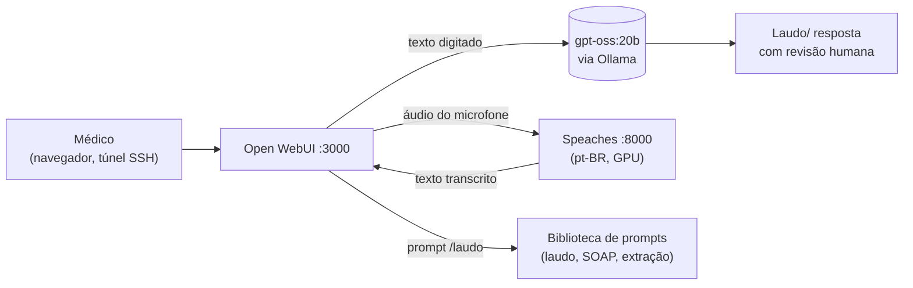

# Tutorial 04 — Open WebUI como frente clínica

O Open WebUI (porta 3000 do hospital, via túnel) é a **interface principal
para clínicos** — e a rota 100% LGPD: tudo fica dentro do hospital.

## Fluxo do uso clínico



## 1. Acesso e contas

```bash
# Túnel (se ainda não tem): ver tutorial 00
# Depois: http://localhost:3000
```

- O **primeiro usuário criado é o admin** (defina senha forte; cadastre
  e-mail de recuperação).
- Admin → *Admin Settings → Users*: convide clínicos; defina papéis
  (user/admin) e, se quiser, autorização de novos cadastros manual.
- Recomendação: desative *Allow new user signups* após cadastrar a equipe.

## 2. O modelo de laudo (preset com system prompt)

*Workspace → Models → +*:

- Model: `gpt-oss:20b`
- Nome de exibição: `LAPAN Laudos`
- System Prompt: cole o template de
  [`configs/prompts/laudo-oftalmologia.md`](../../configs/prompts/laudo-oftalmologia.md)
- Advanced Params: Temperature `0.3` (laudos pedem determinismo)

O clínico seleciona "LAPAN Laudos" e só cola os achados — sem escrever prompt.

## 3. Biblioteca de prompts (atalhos `/`)

*Workspace → Prompts → +* — comandos que expandem no chat:

| Comando | Conteúdo | Origem |
|---|---|---|
| `/laudo` | estrutura completa de laudo oftalmológico | `configs/prompts/laudo-oftalmologia.md` |
| `/soap` | nota SOAP a partir de anamnese | `configs/prompts/transcricao-para-laudo.md` |
| `/extracao` | extrair campos estruturados (JSON) | `configs/prompts/extracao-estruturada.md` |

## 4. Ditado por voz em português (local)

O Open WebUI grava o microfone e transcreve antes de enviar. Aponte o STT
para o nosso Speaches — **Admin → Settings → Audio**:

- Speech-to-Text Engine: **OpenAI** (compatível)
- API Base URL: `http://speaches:8000/v1` (nome interno do container) ou
  `http://127.0.0.1:8000/v1` se preferir via host
- API Key: valor de `SPEACHES_API_KEY` (`.env` do hospital)
- Model: `Systran/faster-whisper-large-v3-turbo` (multilíngue pt-BR)

Teste: clique no microfone no campo de mensagem e dite — o texto aparece
antes do envio, dá para corrigir e então gerar o laudo.

## 5. Base de conhecimento (opcional)

*Workspace → Knowledge → +*: envie protocolos/manuais; depois selecione a
base no chat (ícone de conhecimento) para respostas com citação dos trechos
— processamento local (embeddings `bge-m3`).

## 6. Rotina recomendada (uso real)

1. Consulta transcrita (tutorial 05) ou digitada.
2. No Open WebUI, modelo `LAPAN Laudos`, `/soap` + colar a transcrição.
3. Revisar, ajustar e **assinar** — o modelo sugere; a responsabilidade é
   do médico (resolução CFM 1.821/2007 sobre responsabilidade por laudos).
