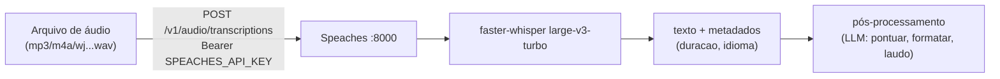

# Tutorial 06 — Transcrição em lote (Speaches)

Para **arquivos** (áudios já gravados, sem tempo real): API
OpenAI-compatible na porta 8000 do hospital, motor faster-whisper
`large-v3-turbo` (multilíngue, pt-BR), na GPU.

## Fluxo



## curl

```bash
# Via túnel (porta 8000) ou de dentro da rede tailnet
curl -X POST "http://localhost:8000/v1/audio/transcriptions" \
  -H "Authorization: Bearer $SPEACHES_API_KEY" \
  -H "Content-Type: multipart/form-data" \
  -F file=@consulta.mp3 \
  -F model=Systran/faster-whisper-large-v3-turbo \
  -F language=pt
# {"text": "..."}
```

## Python (SDK OpenAI)

```python
from openai import OpenAI
client = OpenAI(base_url="http://localhost:8000/v1",
                api_key="SUA_SPEACHES_API_KEY")
with open("consulta.mp3", "rb") as f:
    print(client.audio.transcriptions.create(
        model="Systran/faster-whisper-large-v3-turbo",
        file=f, language="pt").text)
```

## Streaming SSE (transcrição progressiva de arquivo)

O Speaches suporta `stream=True` no endpoint — resposta chega em partes via
SSE conforme o áudio é processado (útil para arquivos longos com feedback):

```bash
curl -N -X POST "http://localhost:8000/v1/audio/transcriptions" \
  -H "Authorization: Bearer $SPEACHES_API_KEY" \
  -F file=@aula.mp3 -F stream=true -F language=pt
```

## Checklist de uso clínico

- Sem diarização aqui (Speaches é só STT) — para separar falantes use o
  WLK (tutorial 05) ou grave canais separados.
- Arquivos ≥1 h funcionam; velocidade depende da GPU disponível no momento
  (modelo titular carregado = mais lento).
- Sempre anonimize antes de usar áudios reais em testes/desenvolvimento.
