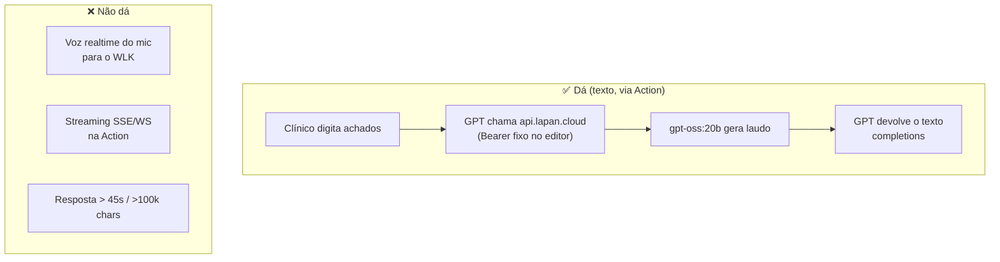

# Tutorial 08 — Custom GPT da OpenAI (alternativa secundária)

> ## ⚠️ AVISO LGPD — leia antes
> Diferente do resto do LAPAN AI, **por esta rota o conteúdo clínico sai do
> hospital**: tudo que o clínico digita (anamnese, dados do paciente), o
> áudio no modo voz (retido 30 dias pela OpenAI) e o **próprio laudo
> gerado pelo nosso modelo** transitam e ficam armazenados no ChatGPT.
> Planos consumer treinam com esses dados (opt-out manual); os termos de
> desenvolvedor da OpenAI **proíbem PHI (HIPAA)** e o DPA deles não cobre
> LGPD. Uso indicado: dados **anonimizados** ou casos não clínicos, de
> preferência em plano Business/Enterprise. Para dados identificáveis, use
> o Open WebUI local (tutorial 04).

## O que dá e o que não dá para fazer

Fonte: documentação OpenAI (Actions: timeout 45 s, payloads <100k chars,
sem headers custom; "custom actions are not available in Voice
conversations with GPTs").

## Passo a passo para criar o GPT

1. **ChatGPT → Explorar GPTs → Criar** (requer plano Plus/Pro/Business).
2. Nome/sugestões à vontade (ex.: *Assistente LAPAN — Laudos*).
3. **Instructions** (essencial para fidelidade):

   > Você encaminha solicitações de laudo ao serviço do hospital. SEMPRE
   > chame a Action `gerarLaudo` com o texto fornecido pelo usuário e
   > devolva o campo `content` da resposta **literalmente, sem resumir,
   > sem reescrever, sem adicionar nada**. Se a Action falhar, informe o
   > erro sem inventar laudo.

4. **Actions → Create Action**:
   - Importe o schema:
     [`configs/openai-gpt/lapan-action-openapi.yaml`](../../configs/openai-gpt/lapan-action-openapi.yaml)
   - Authentication: **API Key**, valor `sk-CHAVE-VIRTUAL-EXCLUSIVA`
     (crie com alias `openai-gpt`, budget baixo — tutorial 02), Auth Type
     `Bearer`.
   - Privacidade da API: domínio `api.lapan.cloud`.
5. Publique (link-only) e distribua o link aos usuários.

## Teste de sanidade

No GPT: *"Achados: masc., 58a, DM2, microaneurismas em arcada temporal
superior. Gere o laudo."* → a resposta deve ser o texto que o
`gpt-oss:20b` produziu (compare com `curl` direto usando o mesmo prompt).
Se o texto vier "parafraseado", reforce a instrução de passthrough
literal.

## Transcrição (assíncrona) de áudio anexado

O clínico pode **anexar** um arquivo de áudio na conversa; com
`openaiFileIdRefs` na Action, o GPT repassa o arquivo para
`/v1/audio/transcriptions` e devolve o texto. Não é realtime — para tempo
real use o tutorial 05.

## Alternativa mais fiel e barata: MCP (Developer mode) — JÁ DISPONÍVEL

Servidor MCP próprio em produção: **`https://api.lapan.cloud/mcp`**
(código em `configs/vps/mcp/`, tools `gerar_laudo` e `listar_modelos`,
validado ponta a ponta em 2026-09-04). Vantagens sobre Action: sem limite
de 45 s, tools com metadados (`readOnlyHint` pula confirmação), mesma
chave virtual `mcp-tools` com budget no LiteLLM.

Conectar no ChatGPT (planos Pro/Business/Enterprise, versão web):

1. Settings → **Connectors → Advanced → Developer mode** (ativar).
2. Settings → **Connectors → Create** → nome "LAPAN AI", Server URL
   `https://api.lapan.cloud/mcp` → "I trust this provider" → sem
   autenticação (o protótipo roda sem OAuth; gastos limitados pela
   chave interna de 20 rpm/US$ 10/30d).
3. Num chat: **+ → More → Developer Mode** → ative o conector LAPAN AI.
4. Peça: *"use gerar_laudo para um rascunho: ceratocone confirmado, 32
   anos"* — a resposta sai do `gpt-oss:20b` do hospital.

Avisos de dados valem igualmente (o texto digitado transita a OpenAI).
Upgrade de segurança quando necessário: OAuth 2.1 no FastMCP
(padrão oauth-proxy) ou allowlist dos IPs de egress da OpenAI no Traefik.
