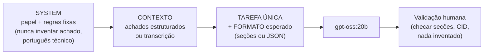

# Tutorial 09 — Padrões de prompt para laudos (gpt-oss:20b)

Receitas testadas na suíte de benchmark (docs/results/20260902-215841).
Templates prontos: pasta [`configs/prompts/`](../../configs/prompts/).

## Anatomia de um prompt de laudo que funciona



Regras de ouro (valem para qualquer receita):

1. **System prompt fixo** com papel e proibições ("não invente achados
   ausentes; se faltar dado, escreva 'não informado'").
2. **Uma tarefa por chamada** — laudo e extração em chamadas separadas.
3. **Peça o formato explicitamente** (seções nomeadas, ou "somente JSON
   válido com estas chaves…"). O gpt-oss:20b obedece bem restrições
   (100% nos casos do benchmark).
4. Temperature baixa (0.2–0.4) para laudo; 0.7 só para texto livre.
5. `max_tokens` folgado (1024+): truncamento é a causa nº 1 de "laudo
   incompleto".

## Receita 1 — Laudo estruturado

System (resumo do `configs/prompts/laudo-oftalmologia.md`):

```
Você é oftalmologista redigindo laudos. Português técnico-formal.
Estrutura obrigatória: Identificação, Técnica, Descrição, Impressão
diagnóstica (com CID-10), Conduta. NÃO invente achados não descritos;
use "não informado" quando faltar. Termine com linha "Laudo gerado por
IA, revisado por: ____".
```

User: dados do paciente + achados brutos (ou transcrição da consulta).

## Receita 2 — Transcrição → nota SOAP → laudo

Cadeia em duas chamadas (mais confiável que uma só):

1. SOAP: "Converta a transcrição em nota SOAP. Transcrição diarizada:
   [Speaker 1 = médico, Speaker 2 = paciente] ..."
2. Laudo: system da Receita 1 + user = a nota SOAP produzida.

Template completo: `configs/prompts/transcricao-para-laudo.md`.

## Receita 3 — Extração estruturada (JSON)

```
System: Você extrai dados estruturados. Responda APENAS com JSON válido,
sem texto fora do JSON.
User: Extraia as chaves {paciente, idade, olho, tecnica, achados[],
conclusao} do texto: "..."
```

Dica de robustez: valide o JSON no seu código; se vier em code fences
(``` ```json ``` ````), remova-as antes do parse — modelos variam.

## Receita 4 — Verificação cruzada (barato e efetivo)

Depois do laudo, uma segunda chamada: *"Compare a lista de achados com o
laudo e liste: (a) achados sem cobertura no laudo; (b) afirmações do laudo
sem achado que as sustente."* — o modelo 8b faz isso bem e barato
(`lapan/qwen3:8b`).

## Como avaliar mudanças de prompt

Replique a suíte do benchmark (`scripts/benchmark_llm.py` +
`configs/ai-stack/benchmark/cases.jsonl`) com seu novo system prompt e
compare às cegas os outputs lado a lado (critérios no campo `rubric`).
