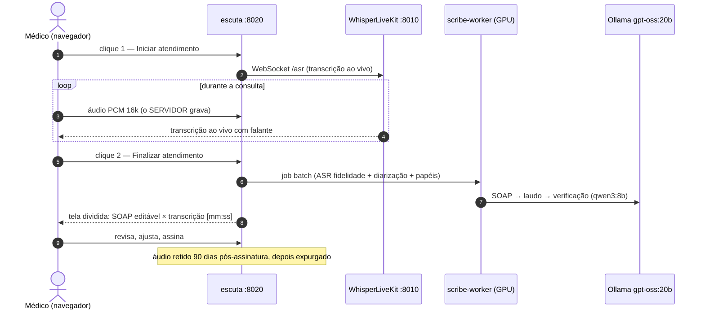

# Tutorial 12 — App de escuta clínica (dois cliques)

Fluxo completo da consulta no navegador: **Iniciar atendimento** → conversa →
**Finalizar atendimento** → prontuário SOAP para revisão em tela dividida.
Serviço `escuta` na porta `8020` (implementa as Fases 1–5 do
[plano de escuta clínica](../00-project-context/07-clinical-listening-solution-plan.md);
detalhes técnicos no [README do serviço](../../services/escuta/README.md)).

## Jornada do médico



## Usar

```bash
# 1. Túnel (porta 8020) — tutorial 00 tem a linha completa
ssh -L 8020:127.0.0.1:8020 hugo@lapan-ai
# 2. Abra http://localhost:8020 (informe o token se ESCUTA_API_TOKEN estiver ativo)
# 3. Preencha seu nome → Iniciar atendimento → converse → Finalizar
```

A gravação é **servidor-side**: se a aba cair, o áudio gravado até aquele
momento permanece e o processamento segue. A transcrição ao vivo (WLK) é
enriquecimento — se o WLK estiver fora, o app avisa e continua gravando.

## Revisão e assinatura

- **Esquerda**: SOAP editável (S/O/A/P) + laudo + achados da verificação
  cruzada (divergências transcrição ↔ SOAP apontadas pela IA).
- **Direita**: transcrição literal com timestamps clicáveis — clicar em
  `[mm:ss]` posiciona o áudio naquele ponto (trilha de evidência).
- **Trocar papéis e regenerar**: se a atribuição Médico/Paciente divergiu
  entre as fontes, o app sinaliza; um clique inverte e regenera a SOAP
  (o transcript imutável permanece intacto).
- **Assinar**: congela a versão; inicia a contagem dos 90 dias de retenção
  do áudio (decisão 2026-09-24 — piloto; meta futura zero).

## Operação (runbook)

| Situação | Ação |
| --- | --- |
| Deploy | `scripts/deploy_ai_stack.sh` e `docker compose up -d --build escuta` |
| Sem transcrição ao vivo | Verificar WLK (`docker compose logs whisper-livekit`); o app segue gravando |
| Papéis trocados | Botão "Trocar papéis e regenerar"; para aprendizado fixo, usar enrollment |
| Enrollment do médico | Botão na tela de revisão (requer `speechbrain`; usa os turnos do médico da consulta corrente) |
| Pesquisa competindo pela GPU | Política clínica-first: consultas têm prioridade; para preemptar o titular automaticamente, montar `docker.sock` no `escuta` e `ESCUTA_UNLOAD_TITULAR_ON_JOB=1` (compose traz a linha comentada) |
| Áudio "404" | Consulta assinada há mais de `ESCUTA_RETENTION_DAYS` — comportamento correto (expurgo auditado) |
| Backup | Incluir `/srv/ai/clinical` (SQLite WAL + opus); idealmente o volume já cifrado (gocryptfs/LUKS, Pilar 7) |

## API (para integrações)

```bash
TOKEN="..."
# upload de arquivo (corpus real, imports)
curl -X POST http://localhost:8020/api/uploads -H "X-Escuta-Token: $TOKEN" \
  -F file=@consulta.opus -F doctor_label="Dr. Souza"
# progresso (SSE)
curl -N http://localhost:8020/api/jobs/<id>/events -H "X-Escuta-Token: $TOKEN"
# transcript diarizado (imutável)
curl http://localhost:8020/api/consultations/<id>/transcript -H "X-Escuta-Token: $TOKEN"
```

Desenvolvimento sem GPU: `ESCUTA_ASR_BACKEND=stub ESCUTA_LLM_BACKEND=stub`
(pipeline inteiro determinístico para testes de UI/integração).

## Limitações atuais (próximos passos do plano)

- Diarização batch (pyannote 4) e enrollment ECAPA exigem a imagem com
  `EXTRAS=gpu` + `HF_TOKEN` com termos pyannote aceitos — sem eles, o
  transcript sai sem separação de falantes (sinalizado no payload).
- WER/DER reais dependem do benchmark com o microfone de sala (Fase 0,
  `scripts/bench_asr.py`); os gates ainda não foram calibrados.
- O modo `ESCUTA_ASR_BACKEND=embedded` (perfil determinístico completo:
  `condition_on_previous_text=False`, fallback de temperatura etc.) assume o
  ASR dentro do worker; o modo `http` (Speaches) aplica o subconjunto suportado
  pelo endpoint.

## Números medidos (validação 2026-09-26, consulta sintética de 60 s)

| Etapa | Tempo | Observação |
| --- | --- | --- |
| ASR (Speaches turbo, GPU) | ~6 s | RTF ≈ 0,10 |
| SOAP (qwen3:8b, think off) | ~4 s | JSON com citações [mm:ss] |
| Laudo (qwen3:8b) | ~4 s | — |
| Verificação cruzada (qwen3:8b) | ~2 s | — |
| **Total** | **23 s** | qwen3:8b residente (6,4 GB) junto com o ASR |

Estimativa para consulta de 60 min: ~7–8 min (ASR ~6 min + cadeia LLM com
map-reduce). Modelo único por decisão de latência; `ESCUTA_LAUDO_MODEL`
permite usar um titular maior em batch noturno.

### Benchmark Fase 0 — corpus sintético neuropediátrico (2026-09-26)

Corpus Edge Neural TTS (21,5 min, consulta crianma 9 anos × médica, ruído HVAC
20/15/10 dB, ground truth TXT/RTTM; gentileza agent-neurovision-assistant):

| Variante | RTF (turbo, GPU) | WER normalizado | CER |
| --- | --- | --- | --- |
| clean | 0,055–0,067 | **5,4%** | 6,9% |
| 15 dB SNR | 0,056–0,097 | **3,1%** | 3,9% |

Gate da Fase 0 (WER < 12%, RTF ≤ 0,15): **aprovado com folga**. 21,5 min de
áudio transcrevem em ~70–90 s. Curiosamente 15 dB ficou levemente abaixo do
clean (ruído como dither; dentro da variabilidade). DER da diarização contra
o RTTM em avaliação (pyannote no container roda em CPU — ver limitações).

### Diarização (estado em 2026-09-26)

Pipeline pyannote community-1 operacional (HF_TOKEN configurado; `num_speakers=2`
exato — com apenas teto `max_speakers` o clustering colapsava para 1 locutor).
**Ressalva honesta**: em corpus sintético TTS (duas vozes piper no mesmo canal),
o clustering fundiu boa parte dos turnos — vozes sintéticas compartilham
características de canal e são o caso patológico. A qualidade real de separação
só é mensurável com gravação de duas pessoas no microfone da sala (Fase 0).
Se necessário, melhorias previstas: re-clustering por turno via
`speaker_embeddings` exposto pelo pipeline, ou migração para
`speaker-diarization-3.1` (aceitar termos também em `pyannote/segmentation-3.0`
e `pyannote/wespeaker-embeddings`). A tripla checagem de papéis e a revisão em
tela dividida cobrem o resto do risco (matriz de falhas #5).
