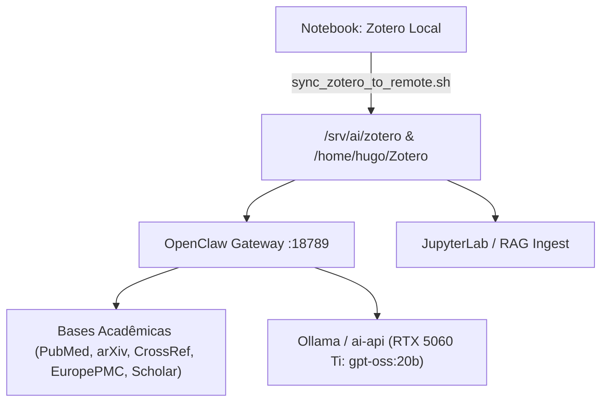

# Tutorial 13 — Revisão Bibliográfica Automatizada & OpenClaw

Este guia explica como sincronizar o Zotero entre o seu notebook e o servidor `lapan-ai`, e como operar o OpenClaw e o motor de revisão bibliográfica multi-fonte para pesquisa acadêmica.

---

## 1. Visão Geral da Arquitetura



---

## 2. Sincronização do Zotero (Notebook ➔ `lapan-ai`)

Para atualizar a biblioteca do servidor com o seu Zotero local sem travar o aplicativo aberto:

```bash
# No seu notebook, execute:
./scripts/sync_zotero_to_remote.sh
```

### O que o script faz automaticamente:
1. Gera um snapshot atômico consistente do banco SQLite local (`.backup`), prevenindo corrupção por transações abertas em WAL.
2. Exclui arquivos temporários e backups pesados (`*.bak`), economizando cerca de 8 GB de tráfego desnecessário.
3. Sincroniza via `rsync` os diretórios de dados e todos os arquivos em `storage/` (PDFs e anexos).
4. Configura o link simbólico em `/srv/ai/zotero` no servidor para consumo imediato pelos containers de IA.

> **Teste seguro prévio:**  
> Use `./scripts/sync_zotero_to_remote.sh --dry-run` para visualizar a lista de arquivos sem transferir dados.

---

## 3. Conexão SSH com Túnel do OpenClaw

Para acessar o OpenClaw e todos os serviços de IA via navegador no notebook:

```bash
ssh -L 3000:127.0.0.1:3000 \
    -L 8888:127.0.0.1:8888 \
    -L 7474:127.0.0.1:7474 \
    -L 7687:127.0.0.1:7687 \
    -L 6333:127.0.0.1:6333 \
    -L 11434:127.0.0.1:11434 \
    -L 8010:127.0.0.1:8010 \
    -L 8000:127.0.0.1:8000 \
    -L 8020:127.0.0.1:8020 \
    -L 18789:127.0.0.1:18789 \
    hugo@lapan-ai
```

Interface web do OpenClaw Gateway: **`http://localhost:18789`**

---

## 4. Executando o Motor de Revisão Bibliográfica Multi-Site

O serviço em [`services/literature-review/review.py`](../../services/literature-review/review.py) permite buscar em 5 motores científicos simultâneos, deduplicar por DOI/título, gerar BibTeX, baixar PDFs Open Access e injetar no Zotero.

### Exemplo 1: Busca e Geração de Relatório com BibTeX

```bash
python3 services/literature-review/review.py \
  --query "deep learning ophthalmology glaucoma detection" \
  --max-per-engine 15 \
  --output-dir ./revisao_glaucoma
```

Arquivos gerados:
- `./revisao_glaucoma/references.bib`: arquivo BibTeX para importação no Zotero ou Overleaf.
- `./revisao_glaucoma/literature_review_report.md`: tabela de evidências, autores, periódico, citações e resumos estruturados.

### Exemplo 2: Busca Abrangente com Download de PDFs e Envio ao Zotero

```bash
python3 services/literature-review/review.py \
  --query "retinal foundation models multimodal medical AI" \
  --engines "pubmed,arxiv,semanticscholar,crossref,europepmc" \
  --download-pdfs \
  --zotero-collection "Fundamentos Retina" \
  --zotero-user-id "12946936" \
  --zotero-api-key "<SEU_ZOTERO_API_KEY>" \
  --output-dir ./revisao_retina
```

---

## 5. Como o OpenClaw Opera com o Zotero e os Modelos Locais

1. **Volume Compartilhado:**  
   O container do OpenClaw monta `/home/hugo/Zotero` como `/home/node/Zotero:rw`. Qualquer alteração ou PDF adicionado pelo agente é refletido imediatamente no Zotero.
2. **Modelos Locais sem Custo de API:**  
   As decisões de síntese, leitura de PDFs e classificação do agente consultam o Ollama em `http://ollama:11434/v1` (`gpt-oss:20b` ou `qwen2.5-coder:7b`) acelerados pela GPU RTX 5060 Ti.
3. **Indexação no RAG:**  
   Os PDFs sincronizados em `/srv/ai/zotero/storage` são automaticamente processados pelo pipeline do Docling e indexados no Qdrant para perguntas e respostas no [Open WebUI](http://localhost:3000).

---

## 6. OCR, IA as a Judge & Detecção de Inconsistências

Para revisões científicas de rigor máximo, ative as flags avançadas de auditoria:

```bash
python3 services/literature-review/review.py \
  --query "optical coherence tomography angiography multimodal" \
  --max-per-engine 10 \
  --download-pdfs \
  --full-text-ocr \
  --judge-arguments \
  --detect-inconsistencies \
  --local-zotero-path ~/Zotero/storage \
  --llm-model "gpt-oss:20b" \
  --output-dir ./revisao_auditada
```

### O que o pipeline de máximo esforço executa:
1. **OCR Híbrido com Tesseract (`eng+por`):** Detecta automaticamente páginas escaneadas ou tabelas complexas que falham na extração digital comum, renderizando a 300 DPI e extraindo o texto completo.
2. **IA as a Judge (Auditor de Argumentos):**
   - Extrai as alegações centrais (*Core Claims*) de cada artigo.
   - Atribui notas de 0 a 10 para Suporte Empírico, Rigor Metodológico, Validade Estatística e Risco de Viés (*Overclaiming*).
   - Emite vereditos formais: `STRONG_EVIDENCE`, `QUALIFIED_SUPPORT`, `WEAK_EVIDENCE` ou `UNFOUNDED_OVERCLAIM`.
3. **Agente Detector de Inconsistências:**
   - **Intra-Artigo:** Caça discordâncias numéricas entre o texto do abstract e as tabelas de resultados, ou conclusões que contradizem as limitações.
   - **Inter-Estudos (Cross-Papers):** Mapeia contradições teóricas e empíricas entre artigos concorrentes da literatura e do acervo Zotero.
4. **Relatório Completo:**
   - Adiciona ao final de `literature_review_report.md` a tabela com todas as avaliações do juiz e a matriz forense de contradições detectadas.

